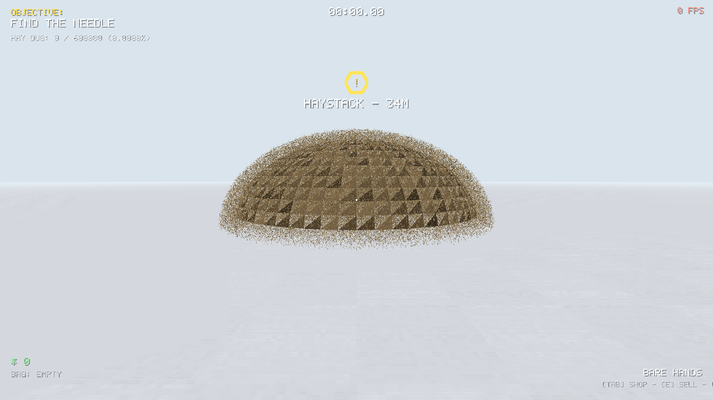
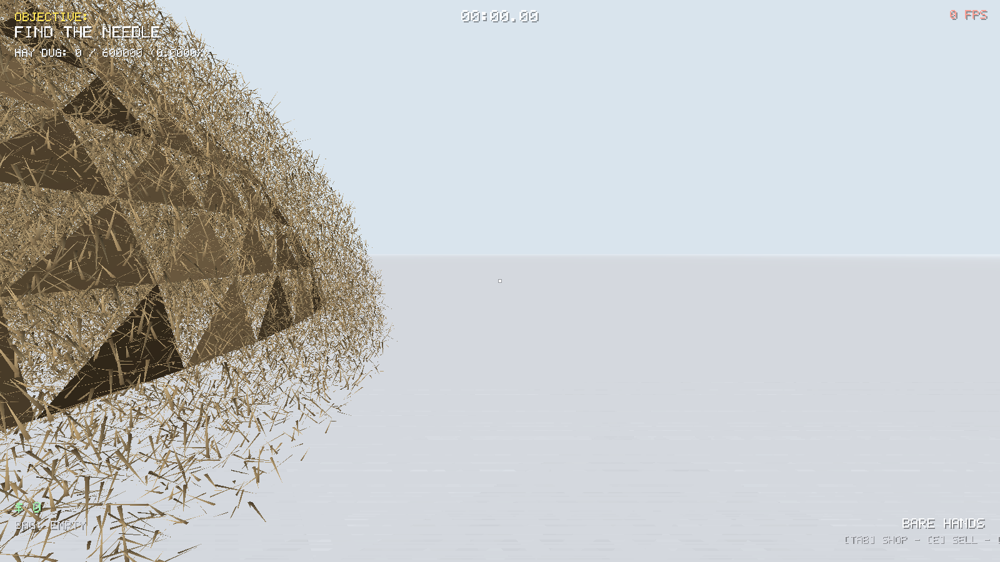

# FIND THE NEEDLE — Rust + wgpu Remake

A faithful, performance-obsessed remake of the viral **"Needle In A Haystack Simulator"**
concept (Studio Bitdot): **1 needle hidden inside millions of pieces of hay**. Dig piece by
piece, sell the valuables you find, buy increasingly ridiculous tools — or play **pure mode**
with no tools at all. Built from scratch in **Rust + wgpu** with one goal: run *fast* on
low-end hardware (the original melts a mid-range laptop at ~16 FPS — this remake targets
**60+ FPS on the same machine**).

<p align="center">
  
  
</p>

## Features (1:1 with the original + extras)

| Feature | Status |
|---|---|
| 1 needle hidden in a giant haystack | ✅ (up to **5,000,000** pieces — "5M ORIGINAL" tier) |
| Pick hay piece by piece (bare hands) | ✅ |
| Valuables hidden in the hay (coin, ring, watch, key, horseshoe…) | ✅ 10 kinds, 3D-modeled |
| Sell valuables for money | ✅ |
| Tool shop progression | ✅ Gloves → Pitchfork → Shovel → Detectors → Magnet → Baler → Vacuum |
| Metal detector with ping radius + "Radius - Xm" tooltip | ✅ |
| **Pure mode** (no upgrades, the true experience) | ✅ |
| **Online/LAN co-op** ("find it with friends") | ✅ UDP, host/join, shared world |
| Objective HUD + hexagon waypoint with live distance | ✅ |
| Seeded procedural worlds (share a seed, same haystack) | ✅ |
| Zoom-inspect (right mouse) | ✅ |
| Save / load / autosave + best time | ✅ |
| Blender-modeled assets (needle, 10 valuables, detector, machines…) | ✅ embedded, zero file IO |
| Resolutions scale, MSAA, quality tiers for potato PCs | ✅ |

## Why it's fast

- **One draw call** for the entire straw pile (GPU instancing, 32-byte packed instances).
- Straws are 2 crossed triangles; all shading is done in tiny WGSL shaders — no textures.
- Static instance buffer: digging only uploads a 4-byte state word per removed straw.
- Offscreen render target with **resolution scale** + optional MSAA, then a single blit.
- No ECS, no allocator churn in the frame loop, `panic=abort`, LTO, `codegen-units=1`.
- Quality tiers: 250k (LOW/POTATO), 450k (MEDIUM), 800k (HIGH), **5,000,000 (ORIGINAL)**.

## Controls

| Key | Action |
|---|---|
| `W A S D` | Move |
| Mouse | Look |
| `LMB` | Dig / pick hay |
| `RMB` / `C` | Zoom-inspect (hold) |
| `Shift` | Sprint |
| `TAB` / `B` | Tool shop |
| `E` | Sell bag |
| `F5` / `F9` | Save / load |
| `ESC` | Pause |

## Co-op (LAN)

1. One player picks **CO-OP: HOST GAME** (UDP port 7777 opens).
2. Others pick **CO-OP: JOIN** and type the host's LAN IP.
3. The world is deterministic from the seed — only dig indices, pickups and
   transforms are synced (idempotent, stateless — survives packet loss).
4. Same haystack. Same needle. Shared progress. Good luck.

## Building

```bash
# you need the Rust toolchain (rustup)
cargo build --release
# run
./target/release/find-the-needle
```

Headless render test (no window needed — great for CI):

```bash
./target/release/find-the-needle --screenshot --out shot.png --count 450000
```

Run tests:

```bash
cargo test --release
```

## Project layout

```
src/
  main.rs      window, input, game loop, co-op glue, screenshot mode
  render.rs    wgpu renderer (instanced straw pile, props, sky, HUD, blit)
  shaders/     WGSL: main scene, sky, HUD, blit
  world.rs     haystack generation, spatial grid, dig logic, packed instances
  game.rs      tools, economy, shop, win/lose, save format
  model.rs     Blender-generated asset loader (.bmesh, embedded)
  net.rs       UDP co-op protocol
  hud.rs       5x7 bitmap font + quad-based UI
  mesh.rs      procedural fallback geometry + straw mesh
  cam.rs       first-person camera with inspect zoom
assets/models/ Blender-generated models (needle, valuables, detector, machines…)
scripts/       gen_models.py — regenerates all assets with headless Blender (bpy)
```

## The models

All 3D assets are generated with **headless Blender via bpy** (`scripts/gen_models.py`) —
the exact engine the blendermcp bridge drives — then exported to a tiny custom binary
format (`pos + color + indices`, ~280 KB total) and **embedded into the executable**
with `include_bytes!`. No runtime file loading, no asset pipeline, no dependencies.

Regenerate them anytime with:

```bash
pip install bpy
python3 scripts/gen_models.py
```

## License

MIT — see [LICENSE](LICENSE).

*Rust + wgpu remake built with ♥ and an unreasonable amount of hay.*
